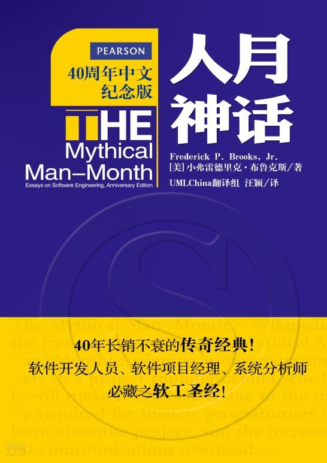

# 目录

- [第 1 章 焦油坑](ch1.md)
- [第 2 章 人月神话](ch2.md)
- [第 3 章 外科手术队伍](ch3.md)
- [第 4 章 贵族专制、民主政治和系统设计](ch4.md)
- [第 5 章 画蛇添足](ch5.md)
- [第 6 章 贯彻执行](ch6.md)
- [第 7 章 为什么巴比伦塔会失败？](ch7.md)
- [第 8 章 胸有成竹](ch8.md)
- [第 9 章 削足适履](ch9.md)
- [第 10 章 提纲挈领](ch10.md)
- [第 11 章 未雨绸缪](ch11.md)
- [第 12 章 干将莫邪](ch12.md)
- [第 13 章 整体部分](ch13.md)
- [第 14 章 祸起萧墙](ch14.md)
- [第 15 章 另外一面](ch15.md)
- [第 16 章 没有银弹－软件工程中的根本和次要问题](ch16.md)
- [第 17 章 再论《没有银弹》](ch17.md)
- [第 18 章 《人月神话》的观点：是或非？](ch18.md)
- [第 19 章 20 年后的人月神话](ch19.md)
